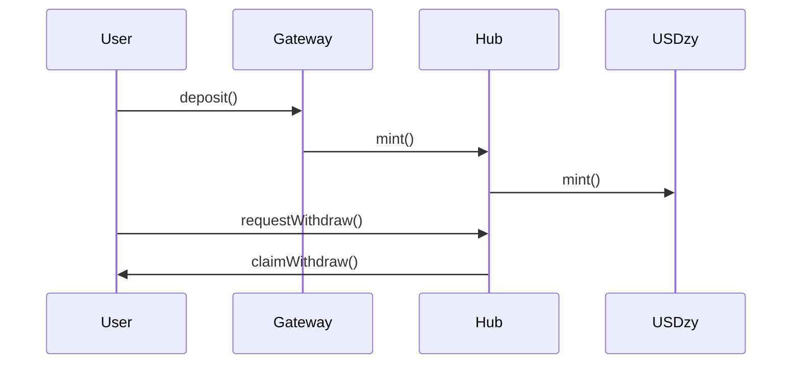
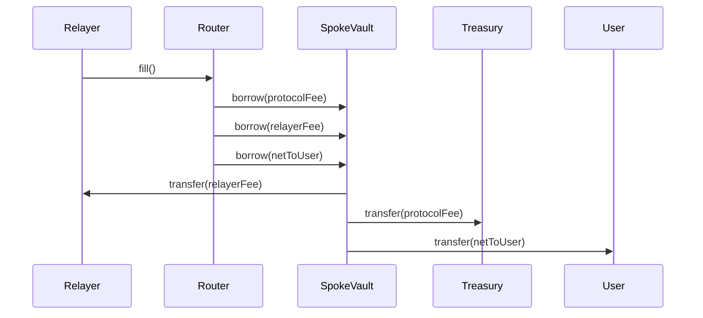
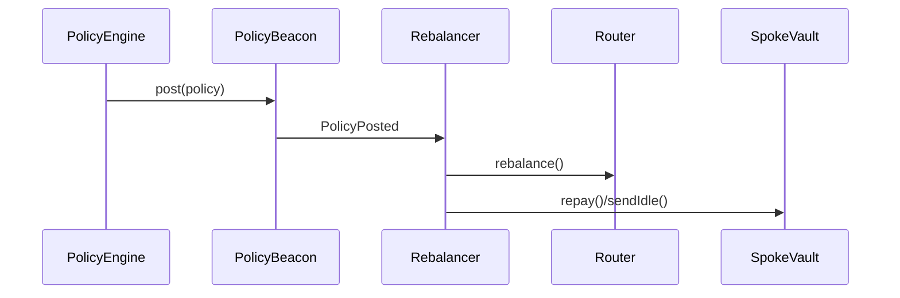

# BACKEND_BLUEPRINT.md

## System Map

### Phase-1 (Hub + USDzy)
- **src/Hub.sol**: Central asset manager, withdrawal queue, config, admin ops. Events: `AssetConfigSet`, `WithdrawRequested`, `WithdrawClaimed`, `WithdrawDelaySet`, `MaxStalenessSet`. Roles: DEFAULT_ADMIN, PAUSER.
- **src/USDzy.sol**: Synthetic asset, mint/burn, transfer. Events: `Transfer`, `Mint`, `Burn`. Roles: DEFAULT_ADMIN.
- **test/Hub_***: Withdrawal, config, queue tests.
- **script/Deploy_Phase1.s.sol, script/DryRun_Sepolia.s.sol**: Deployment, dry-run scripts.

### Phase-1.5 (Incentives)
- **src/zpx/ZPXArb.sol**: Arbitrage logic. Events: `ArbitrageExecuted`. Roles: DEFAULT_ADMIN.
- **src/zpx/MintGate_Arb.sol**: Mint gate for incentives. Events: `MintGate`. Roles: DEFAULT_ADMIN.
- **src/zpx/ZPXRewarder.sol**: LP rewarder. Events: `Rewarded`. Roles: DEFAULT_ADMIN.
- **test/zpx/**: Incentive tests.
- **script/Deploy_Phase1_5_Arb.s.sol**: Deployment script.

### Phase-2 (Spokes/Router/Messaging/Factory)
- **src/spoke/SpokeVault.sol**: Spoke-side vault, borrow/repay, utilization, idle send. Events: `Borrowed`, `Repaid`, `IdleSent`. Roles: DEFAULT_ADMIN, BORROWER.
- **src/router/Router.sol**: Fee logic, fill, rebalance, fee split. Events: `FeeApplied`, `FillExecuted`, `RebalanceSuggested`. Roles: DEFAULT_ADMIN, RELAYER, KEEPER.
- **src/messaging/MessagingEndpointReceiver.sol, src/messaging/MockAdapter.sol**: Cross-chain messaging. Events: `MessageReceived`. Roles: DEFAULT_ADMIN.
- **src/usdzy/USDzyRemoteMinter.sol**: Gateway minting. Events: `MintFromGateway`. Roles: DEFAULT_ADMIN, GATEWAY_ROLE.
- **src/factory/Factory.sol**: Vault/router creation. Events: `VaultCreated`, `RouterCreated`. Roles: DEFAULT_ADMIN.
- **test/phase2/**: End-to-end, fee, rebalance, fill tests.
- **script/Deploy_Phase2_Spoke.s.sol**: Deployment script.

### Policy & PPS Beacons + Gateway
- **src/policy/IPolicySource.sol, src/policy/PolicyBeacon.sol**: Policy posting. Events: `PolicyPosted`. Roles: DEFAULT_ADMIN.
- **src/pps/IPpsSource.sol, src/pps/PpsBeacon.sol, src/pps/PpsMirror.sol**: PPS posting. Events: `PpsPosted`. Roles: DEFAULT_ADMIN.
- **src/aggregators/SharesAggregator.sol**: Share aggregation. Events: `SharesAggregated`. Roles: DEFAULT_ADMIN.
- **src/gateway/LocalDepositGateway.sol**: User deposits. Events: `DepositReceived`. Roles: DEFAULT_ADMIN.
- **test/policy/**, **test/pps/**, **test/gateway/**: Policy, PPS, gateway tests.

### Storage Layouts
- **storage/*.json**: Contract storage layouts for upgrades/indexing.

### CI/Static Analysis/Docs
- **docs/**: Audit briefs, protocol docs.
- **.github/workflows/**: CI, lint, test automation.
- **README.md**: Overview, setup, usage.

---

## Event & Call Integration Matrix

| Contract | Events to Index | Bot Calls | Roles | Error/Edge Cases |
|----------|-----------------|----------|-------|-----------------|
| Hub | AssetConfigSet, WithdrawRequested, WithdrawClaimed, WithdrawDelaySet, MaxStalenessSet | setAssetConfig, setWithdrawDelay, setMaxStaleness | DEFAULT_ADMIN | Withdraw queue stuck, staleness violation |
| USDzy | Transfer, Mint, Burn | mint, burn | DEFAULT_ADMIN | Mint/burn limits |
| ZPXArb | ArbitrageExecuted | arbitrage | DEFAULT_ADMIN | Slippage, failed arb |
| MintGate_Arb | MintGate | mintGate | DEFAULT_ADMIN | Gate limits |
| ZPXRewarder | Rewarded | reward | DEFAULT_ADMIN | Reward overflows |
| SpokeVault | Borrowed, Repaid, IdleSent | borrow, repay, sendIdle, setBorrowCap, setMaxUtilizationBps | DEFAULT_ADMIN, BORROWER | Utilization cap, borrow overflows |
| Router | FeeApplied, FillExecuted, RebalanceSuggested | fill, setProtocolFeeBps, setRelayerFeeBps, setFeeSplit, setFeeCollector, rebalance | DEFAULT_ADMIN, RELAYER, KEEPER | Fee math, split errors |
| MessagingEndpointReceiver | MessageReceived | receiveMessage | DEFAULT_ADMIN | Message replay, nonce collision |
| USDzyRemoteMinter | MintFromGateway | mintFromGateway, setGateway | DEFAULT_ADMIN, GATEWAY_ROLE | Gateway config, mint limits |
| Factory | VaultCreated, RouterCreated | createVault, createRouter | DEFAULT_ADMIN | Factory limits |
| PolicyBeacon | PolicyPosted | post, setPolicyConfig | DEFAULT_ADMIN | Policy staleness |
| PpsBeacon/PpsMirror | PpsPosted | post | DEFAULT_ADMIN | PPS staleness |
| SharesAggregator | SharesAggregated | aggregateShares | DEFAULT_ADMIN | Share rounding |
| LocalDepositGateway | DepositReceived | deposit, setDepositConfig | DEFAULT_ADMIN | Deposit limits |

---

## Backend Services (Microservices)

- **Policy Engine**: Computes MA7, classifies state, posts to PolicyBeacon/PpsMirror. Inputs: TVL, PPS, oracle feeds. Outputs: PolicyPosted, PpsPosted txs. Depends: RPC, DB, Chainlink/DIA.
- **Rebalancer**: Listens to PolicyPosted/RebalanceSuggested, sends top-ups (Hub→Spoke), calls Router.repay(), SpokeVault.sendIdle(). Inputs: policy events, router health. Outputs: on-chain txs. Depends: RPC, DB.
- **Relayer**: Listens for fill requests, calls Router.fill(), manages relayer fee, gas, retries. Inputs: bridging requests, FillExecuted. Outputs: on-chain txs. Depends: RPC, DB, queue.
- **USDzy Gateway Service**: Listens to LocalDepositGateway deposits, mints via USDzyRemoteMinter.mintFromGateway(). Inputs: DepositReceived. Outputs: MintFromGateway txs. Depends: RPC, DB.
- **Oracle Poster**: Posts PPS/Policy to beacons. Inputs: oracle feeds, cron. Outputs: PpsPosted, PolicyPosted txs. Depends: RPC, DB, Chainlink/DIA.
- **Treasury & Fee Accounting**: Indexes FeeApplied, splits protocol/LP fee, reconciles treasury vs LP. Inputs: FeeApplied. Outputs: DB writes, alerts. Depends: DB.
- **Admin Ops Bot**: Rotates feeds/haircuts/staleness, updates Router fee bps/splits, pauses/unpauses, audits roles. Inputs: config changes, cron. Outputs: on-chain txs. Depends: RPC, DB.

---

## Data Model (Postgres DDL)
```sql
CREATE TABLE chains (
  id SERIAL PRIMARY KEY,
  chain_id BIGINT UNIQUE NOT NULL,
  name TEXT,
  rpc_url TEXT,
  confirmations INT
);
CREATE TABLE assets (
  id SERIAL PRIMARY KEY,
  symbol TEXT,
  decimals INT,
  chain_id BIGINT REFERENCES chains(chain_id)
);
CREATE TABLE contracts (
  id SERIAL PRIMARY KEY,
  address TEXT UNIQUE NOT NULL,
  chain_id BIGINT REFERENCES chains(chain_id),
  type TEXT,
  name TEXT
);
CREATE TABLE roles (
  id SERIAL PRIMARY KEY,
  contract_id INT REFERENCES contracts(id),
  role TEXT,
  holder TEXT
);
CREATE TABLE lp_deposits (
  id SERIAL PRIMARY KEY,
  chain_id BIGINT,
  gateway_id INT,
  user TEXT,
  asset_id INT,
  amount NUMERIC,
  timestamp TIMESTAMP,
  UNIQUE(chain_id, gateway_id, user, timestamp)
);
CREATE TABLE withdraw_requests (
  id SERIAL PRIMARY KEY,
  chain_id BIGINT,
  hub_id INT,
  user TEXT,
  asset_id INT,
  amount NUMERIC,
  timestamp TIMESTAMP,
  UNIQUE(chain_id, hub_id, user, timestamp)
);
CREATE TABLE fills (
  id SERIAL PRIMARY KEY,
  chain_id BIGINT,
  router_id INT,
  user TEXT,
  amount NUMERIC,
  protocol_fee NUMERIC,
  relayer_fee NUMERIC,
  protocol_to_treasury NUMERIC,
  protocol_to_lps NUMERIC,
  net_to_user NUMERIC,
  timestamp TIMESTAMP,
  UNIQUE(chain_id, router_id, user, timestamp)
);
CREATE TABLE repays (
  id SERIAL PRIMARY KEY,
  chain_id BIGINT,
  vault_id INT,
  user TEXT,
  amount NUMERIC,
  timestamp TIMESTAMP,
  UNIQUE(chain_id, vault_id, user, timestamp)
);
CREATE TABLE fees (
  id SERIAL PRIMARY KEY,
  chain_id BIGINT,
  router_id INT,
  protocol_fee NUMERIC,
  relayer_fee NUMERIC,
  protocol_to_treasury NUMERIC,
  protocol_to_lps NUMERIC,
  timestamp TIMESTAMP,
  UNIQUE(chain_id, router_id, timestamp)
);
CREATE TABLE policy_advisories (
  id SERIAL PRIMARY KEY,
  chain_id BIGINT,
  router_id INT,
  state TEXT,
  coverage NUMERIC,
  timestamp TIMESTAMP,
  UNIQUE(chain_id, router_id, timestamp)
);
CREATE TABLE pps_posts (
  id SERIAL PRIMARY KEY,
  chain_id BIGINT,
  router_id INT,
  pps NUMERIC,
  timestamp TIMESTAMP,
  UNIQUE(chain_id, router_id, timestamp)
);
CREATE TABLE vault_tvl_snapshots (
  id SERIAL PRIMARY KEY,
  chain_id BIGINT,
  vault_id INT,
  tvl NUMERIC,
  timestamp TIMESTAMP,
  UNIQUE(chain_id, vault_id, timestamp)
);
CREATE TABLE router_day_bins (
  id SERIAL PRIMARY KEY,
  chain_id BIGINT,
  router_id INT,
  day DATE,
  fills INT,
  fees NUMERIC,
  UNIQUE(chain_id, router_id, day)
);
CREATE TABLE topups (
  id SERIAL PRIMARY KEY,
  chain_id BIGINT,
  vault_id INT,
  amount NUMERIC,
  timestamp TIMESTAMP,
  UNIQUE(chain_id, vault_id, timestamp)
);
CREATE TABLE drains (
  id SERIAL PRIMARY KEY,
  chain_id BIGINT,
  vault_id INT,
  amount NUMERIC,
  timestamp TIMESTAMP,
  UNIQUE(chain_id, vault_id, timestamp)
);
CREATE TABLE gate_mints (
  id SERIAL PRIMARY KEY,
  chain_id BIGINT,
  minter_id INT,
  user TEXT,
  amount NUMERIC,
  timestamp TIMESTAMP,
  UNIQUE(chain_id, minter_id, user, timestamp)
);
CREATE TABLE errors (
  id SERIAL PRIMARY KEY,
  service TEXT,
  error TEXT,
  timestamp TIMESTAMP
);
```

---

## Recent security hardening (2025-09-15)

- Added targeted hardening and tests following a Slither run. Key changes pushed to `main`:
  - `MockAdapter.send` now uses a reentrancy guard (test adapter) and validates destination non-zero. This reduces a Slither reentrancy finding for test adapters.
  - `Factory.deploySpoke` now inherits `ReentrancyGuardUpgradeable` and the deployment flow is `nonReentrant` to reduce external-call ordering risks when wiring new proxies.
  - `USDzyRemoteMinter` now initializes and uses `ReentrancyGuardUpgradeable` and protects `mintFromGateway`/`onMessage` with `nonReentrant`.
  - `Router.fill` and `Hub.quoteUsd6`/`totalAssetsUsd6` were updated to use `Math.mulDiv` for safer multiply/divide ordering and improved precision. Some remaining divide-before-multiply flags in other files were noted for follow-up.
  - Captured previously-unused external returns (vault.borrow / vault.repay) and emitted debt in `repay` for clearer accounting.
  - Added negative unit tests asserting unauthorized callers cannot call UUPS `upgradeTo` on proxies for key contracts (upgrade access control tests).
  - Generated Slither JSON reports (committed): `slither-report-after.json`, `slither-report-after2.json`, `slither-report-after3.json` in repo root. Tests green after edits.

Notes / residual findings from Slither:
- Several `unprotected-upgradeable-contract` findings remain flagged by Slither and require a careful audit (some are false-positives stemming from init patterns); recommended follow-up: audit `_authorizeUpgrade` across flagged contracts and add negative upgrade tests per contract.
- `calls-inside-a-loop` for `Hub.totalAssetsUsd6` persists because balanceOf and oracle reads are still invoked per-token; mitigations include bounding token list, caching prices, or accepting as operational with monitored SLOs.
- A small number of `divide-before-multiply` cases remain (e.g., in `LocalDepositGateway` and withdraw math) and can be converted to `Math.mulDiv` safely.


## APIs (REST/GraphQL)
- **GET /tvl**: chain, vault, tvl, timestamp
- **GET /pps**: chain, router, pps, timestamp
- **GET /policy**: chain, router, state, coverage, timestamp
- **GET /fees**: chain, router, protocol_fee, relayer_fee, protocol_to_treasury, protocol_to_lps, timestamp
- **GET /fills**: chain, router, user, amount, timestamp
- **POST /topup**: chain, vault, amount (auth required)
- **POST /drain**: chain, vault, amount (auth required)
- **POST /policy/post**: chain, router, state, coverage (auth required)
- **POST /pps/post**: chain, router, pps (auth required)
- **POST /admin/action**: contract, method, args (auth required)

---

## Queues & Scheduling
- **policy.evaluate**: hourly, idempotency: chain+router+hour
- **router.rebalance**: on policy event, idempotency: chain+router+timestamp
- **mint.gateway**: on deposit, idempotency: chain+gateway+user+amount+nonce
- **oracle.post**: hourly, idempotency: chain+router+hour
- **fee.accounting**: on FeeApplied, idempotency: chain+router+timestamp
- **retry/backoff**: exponential, max 5 retries, dead-letter queue

---

## Config & Secrets
- **ENV vars per service:**
  - DB_URL
  - REDIS_URL
  - SQS_URL
  - RPC_ARBITRUM, RPC_OPTIMISM, ...
  - PRIVATE_KEY_POSTER, PRIVATE_KEY_KEEPER, PRIVATE_KEY_RELAYER, PRIVATE_KEY_GATEWAY
  - DIA_FEED_CONFIG, CHAINLINK_FEED_CONFIG
  - CCTP_ENDPOINTS
  - TELEMETRY_URL

---

## Observability & SLOs
- **Metrics:** policy freshness, rebalance lag, reserve coverage, tx success rate
- **Alerts:** stale oracle/policy, reserve <40%, MA7 surge, failed txs
- **Dashboards:** TVL, PPS, policy state, fee revenue, queue status

---

## Diagrams (Mermaid)

### Deposit→Hub mint→Withdraw Queue→Claim


### LNR fill (dest-side fee skim) with Router/SpokeVault


### Policy Engine → Beacon → Rebalancer top-up/drain


---

## Acceptance Checklist
- [ ] Index all contract events (see matrix)
- [ ] Implement Policy Engine (MA7, state, beacon post)
- [ ] Implement Rebalancer (top-up, drain, repay)
- [ ] Implement Relayer (fill, fee collection, retry)
- [ ] Implement Gateway minting (deposit, mintFromGateway)
- [ ] Implement Oracle Poster (PPS/Policy)
- [ ] Implement Fee Accounting (FeeApplied, split)
- [ ] Implement Admin Ops Bot (config, role audit)
- [ ] Implement REST/GraphQL APIs for dashboards/ops
- [ ] Implement queues, idempotency, retry/backoff
- [ ] Implement metrics, alerts, dashboards
- [ ] Secure secrets, role keys, config
- [ ] Document runbook, env vars, health checks

---
This blueprint is self-contained and actionable for backend engineers supporting zpx-lp-vault. All contract/event names, roles, and integration points are sourced from the repo files listed above.
