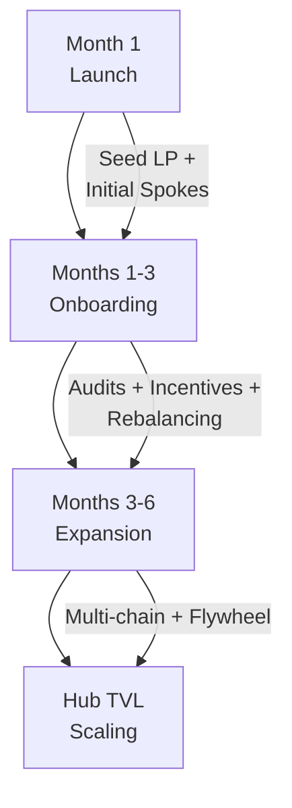

# ZoopX – TVL Growth Projections

This document outlines the Hub & Spoke liquidity vault architecture, phased roadmap, and projected Total Value Locked (TVL) growth for the first six months post‑launch. Assumptions use conservative benchmarks from Aave v3 (Optimism), Curve, Velodrome, and DefiLlama averages for deposit behavior.

## 1. Hub & Spoke Architecture

**Hub Vault (Base chain)**
* Central liquidity reservoir.
* Absorbs excess from Spoke Vaults (above target buffers).
* Redeploys liquidity to chains/spokes with higher utilization demand.
* Increases effective interoperable TVL (iTVL) by reallocating idle capital.

**Spoke Vaults (Superchain + non‑EVM chains)**
* Accept user deposits in stablecoins and major tokens.
* Maintain local buffers sized to recent settlement / withdrawal velocity:
  * Superchain L2s (Optimism, Base, Mode, Zora): ~70–80% of 7‑day average net outflow (fast L2<->L2 movement via `L2ToL2CrossDomainMessenger`).
  * Non‑EVM chains (Solana, Sui, Aptos): ~100% of 7‑day average (slower bridging latency => higher safety buffer).
* Push excess liquidity to Hub automatically when buffers refill beyond target.

## 2. Roadmap (Phased Growth)



<details><summary>ASCII fallback (if Mermaid not rendered)</summary>

```
Month 1 (Launch) --> Months 1-3 (Onboarding) --> Months 3-6 (Expansion) --> Hub TVL Scaling
   | Seed LP + Initial Spokes
   | Audits + Incentives + Rebalancing
   | Multi-chain + Flywheel
```

</details>

### Month 1: Launch Phase
* Deploy Hub + initial Spoke Vaults (Superchain priority).
* Bootstrap liquidity with protocol-owned LP (e.g. ZPX/USDT) + seed stablecoin balances.
* Begin measuring withdrawal velocity to calibrate spoke buffers.
* **Target TVL:** **1.2M OP (~$830k USD at $0.69/OP)**.

### Months 1–3: Public Onboarding Phase
* Open audited vaults (stablecoins + major tokens: USDC/USDT/DAI/ETH/OP).
* Launch incentive programs (ZPX emissions, early adopter multipliers).
* Activate smart rebalancing: excess → Hub; Hub redistributes to under-supplied spokes.
* **Target TVL:** **7.25M OP (~$5.0M USD)**.

### Months 3–6: Growth & Expansion
* Expand to additional EVM chains (Polygon, Arbitrum, Avalanche) + non‑EVM (Solana, Sui, Aptos).
* Integrate external routing & aggregator order flow (increasing organic deposits).
* Reinforce incentive flywheel (cross-chain coverage + reliability -> stickier TVL).
* **Target TVL:** **25.0M OP (~$17.25M USD)**.

## 3. Core Assumptions

| Variable | Value | Rationale |
|----------|-------|-----------|
| Avg TVL / user | $350 | Benchmarks: Aave v3 OP market, mid-tail DeFi users |
| Users (Month 1) | ~3,000 | Early community + incentivized on-chain users |
| Users (Month 3) | ~15,000 | Network effect + incentive cycle |
| Users (Month 6) | ~50,000 | Multi-chain expansion & integrations |
| OP Price | $0.69 | Spot (Sept 24, 2025); adjust in future re-forecasts |

## 4. Projection Table

| Period   | Users  | Avg TVL/User (USD) | Total TVL (USD) | OP Price (USD) | Projected TVL (OP) |
|----------|--------|--------------------|-----------------|----------------|--------------------|
| Month 1  | 3,000  | 350                | 1,050,000       | 0.69           | ~1,200,000         |
| Month 3  | 15,000 | 350                | 5,250,000       | 0.69           | ~7,250,000         |
| Month 6  | 50,000 | 350                | 17,500,000      | 0.69           | ~25,000,000        |

Formula references:
* Total TVL (USD) = Users × Avg TVL/User.
* Projected TVL (OP) ≈ TVL (USD) ÷ OP Price (rounded to nearest reasonable figure for narrative clarity).

## 5. TVL Composition Policy

**Included:**
* Stablecoins (USDC, USDT, DAI)
* Major L2/EVM assets (ETH, OP) and blue‑chip tokens used within protocol pools
* LP tokens locked in vault strategy contracts
* Protocol-owned liquidity pairs (e.g. ZPX/USDT) when actively deployed in routing / stability modules

**Excluded:**
* Pure single-asset native staking that contributes no routing / settlement liquidity
* Illiquid governance-only positions lacking withdrawal depth

## 6. Risk & Buffer Logic
* Spoke buffer sizing recalibrated daily from 7‑day trailing withdrawal percentile.
* Hub redeployment threshold triggers when aggregate idle capital > configured utilization slack.
* Non‑EVM spokes retain higher static buffer (bridge latency + settlement risk).

## 7. Reforecast Triggers
* OP price ±25% move (recompute OP-denominated targets)
* User growth deviation >30% vs plan for two consecutive weeks
* Launch of high-throughput spoke (e.g. Solana) accelerating deposit velocity

## 8. Sources
* DefiLlama – TVL Benchmarks: https://defillama.com/
* Aave v3 Optimism public market stats
* Curve & Velodrome liquidity pool depth metrics
* Optimism Grants: How to Measure TVL – https://app.charmverse.io/op-grants/how-to-measure-tvl-7815580862836209

---
_This projection is non-binding and intended for strategic planning & grant reporting. All figures will be revisited monthly._
